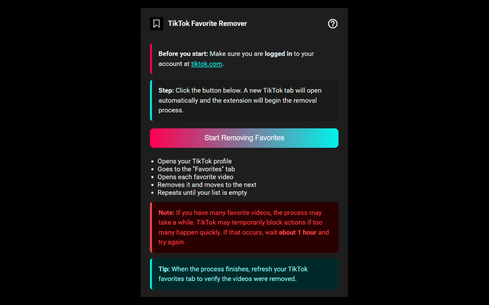

# TikTok All Favorite Videos Remover

Remove all your favorite videos on TikTok automatically with a single action.

---

## GitAds Sponsored

---

## Features

- Opens your TikTok profile in a new tab automatically
- Opens Favorites → Posts and processes each newly loaded grid batch before loading the next
- Offers an optional full read-only analysis mode and requires confirmation before incremental removal
- Reads the authenticated Favorites grid and uses TikTok's own web endpoint to remove confirmed favorites
- In-page control panel on TikTok with:
  - Live status and statistics for listed, matched, processed, verified, remaining, and failed items
  - Pause / Resume / Stop with immediate cancellation of active waits and requests
  - Downloadable JSON or CSV report with one final status per item
- Re-scans TikTok after removal to verify which favorites actually disappeared
- Retries temporary network and server failures with bounded exponential backoff
- Configurable delay between removals (1–10 seconds, random range or fixed set)
- Optional keyword filter to only remove favorites that match certain terms

---

## Installation

### From Chrome Web Store

[Install from Chrome Web Store](https://chromewebstore.google.com/detail/tiktok-all-favorite-video/cbjkccccmffolddklbkedlndlfokcpbn)

### Manual installation (for developers)

1. Clone this repository or download the source code.
2. Go to `chrome://extensions` in Google Chrome.
3. Enable **Developer mode** (top right toggle).
4. Click **"Load unpacked"** and select the project folder.

---

## How to use

1. Make sure you are logged in to your TikTok account at [tiktok.com](https://tiktok.com).
2. Click the extension icon in the Chrome toolbar.
3. Configure options in the popup:
   - Whether to filter by keywords or remove all favorites
   - Interval mode (random range or fixed set of seconds between removals)
   - Pause between pages and report format (JSON or CSV)
4. Click **Analyze Without Removing** for a read-only preview, or **Scan and Remove Favorites**.
5. A TikTok tab will open automatically. The in-page panel will appear near the top-right:
   - Shows current status (preparing, listing, removing, between pages, done)
   - Review the first-batch match count and explicitly confirm page-by-page removal
   - You can pause, resume, or stop the process
   - Download a report at any time once scan data exists
6. Keep the tab open until the process finishes. Do not close it during the operation.

---

## Behavior details

- When you are not logged in and TikTok redirects `/profile` to `/foryou`, the panel:
  - Detects that you are not logged in.
  - Shows a clear message explaining that you must sign in and start again.
  - Marks the process as paused and disables the pause/resume button.
- When the extension cannot identify your account (no valid session data found), it shows a similar error message and stops safely.
- Normal removal filters and processes each loaded grid batch before scrolling for more. Full pre-scanning is reserved for read-only analysis mode.
- Only items that match your keyword filter (if enabled) are removed and included in the report.
- After requests finish, up to three fresh grid scans compare the original candidate IDs with TikTok's current Favorites list.
- Failures:
  - Any failed removal is logged in the panel as a failure.
  - Failed items are included in the report with a status flag so you can review them later.
  - If too many removals fail in a row, the extension stops automatically, shows a message, and lets you download the report.

---

## Report format

The report includes metadata, summary totals, diagnostics, and each matched item exactly once:

- JSON: `metadata`, `summary`, `items`, and `diagnostics`
- CSV: one table with the following columns
  - `id`
  - `authorName`
  - `desc`
  - `url`
  - `status` (`matched`, `verified_removed`, `still_present`, `request_failed`, `request_succeeded_unverified`, or `not_processed`)

CSV cells beginning with spreadsheet formula characters are escaped.

This makes it easy to audit what was removed and what failed, or to keep a backup list of favorite videos.

---

## Permissions

The extension uses the following Chrome permissions:

- `host_permissions` (`https://www.tiktok.com/*`): allows the extension to run only on TikTok pages.
- `scripting`: injects and runs the content script on TikTok pages, executes the confirmed removal request in TikTok's page context, and reads session data needed to identify your account.
- `tabs`: opens your TikTok profile in a new tab and communicates with that tab.
- `storage`: saves your configuration locally and keeps a temporary active-job marker (automatically expired after 12 hours) to prevent overlapping runs.

No analytics, tracking, or external servers are used. All operations happen in your browser, talking directly to TikTok.

---

## Important notes

- The process may take time depending on how many favorite videos you have.
- If TikTok temporarily blocks actions (rate limiting), wait about 1 hour and run the extension again.
- The final status is based on a fresh scan of the TikTok Favorites grid, rather than only on whether a removal request returned success.

---

## Contributing

Contributions are welcome!  
If you find a bug or have an idea for improvement, feel free to open an issue or a pull request.

---

## License

This project is licensed under the [MIT License](https://opensource.org/license/mit/).

<!-- GitAds-Verify: 2U3RGGXDR7ECMBBHCE2Q94MLN5LUAPN6 -->
