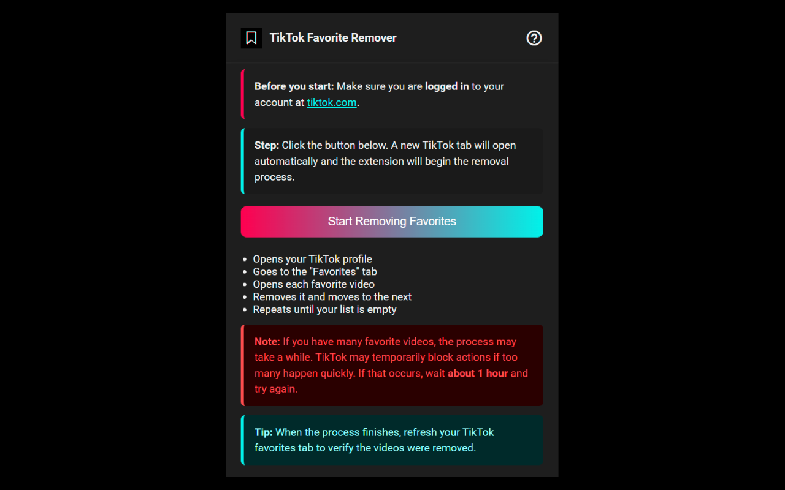

# TikTok All Favorite Videos Remover

Remove all your favorite videos on TikTok automatically — no clicks, no scrolling, just one button.

---

## Features

- ✅ Opens your TikTok profile in a new tab automatically
- ✅ Accesses your "Favorites" tab
- ✅ Enters each video and removes it from favorites
- ✅ Proceeds to the next video until the list is empty
- ✅ Fully automatic — just start and let it run

---

## Installation

### From Chrome Web Store

👉 [Install from Chrome Web Store](https://chrome.google.com/webstore/detail/tiktok-all-favorite-video/cbjkccccmffolddklbkedlndlfokcpbn)

### 🛠️ Manual Installation (for developers)

1. Clone this repository or download the source code.
2. Go to `chrome://extensions` in Google Chrome.
3. Enable **Developer mode** (top right toggle).
4. Click **"Load unpacked"** and select the project folder.

---

## How to Use

1. Make sure you're **logged in** to your TikTok account at [tiktok.com](https://tiktok.com).
2. Click the extension icon in the Chrome toolbar.
3. Click **"Start Removing Favorites"**.
4. A new TikTok tab will open automatically.
5. ✅ The extension will:
   - Navigate to your profile
   - Open the "Favorites" tab
   - Remove each video from your favorites one by one
6. Keep the tab open until the process finishes. **Do not close it** during the operation.

---

## Important Notes

- The process may take time depending on how many favorites you have.
- If TikTok temporarily blocks actions (rate limiting), wait about **1 hour** and run the extension again.
- To confirm everything was removed, **refresh your Favorites tab** after the process completes.

---

## Contributing

Contributions are welcome!  
If you find a bug or have an idea for improvement, feel free to open an issue or a pull request.

---

## License

This project is licensed under the [MIT License](https://opensource.org/license/mit/).

---

## GitAds Sponsored

<!-- GitAds-Verify: RLGNWZFM6UVMU4WTE8B35QUVHB22SUTO -->
